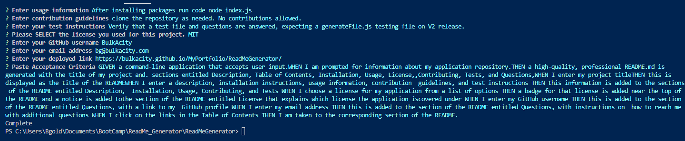

  
# README Generator Starter Code
  The following code will ask you a series of questions utilizing inquiery. Then a template of a readME file will be saved.
  MIT
  [A deployed version can be viewed here.](https://bulkacity.github.io/MyPortfolio/ReadMeGenerator/)
  
  
---
# Contents
1. [About](#about)
    1. [User Story](#user%20story)
    2. [Acceptance criteria](#acceptance%20criteria)
    3. [Visuals](#visuals)
    4. [Build](#build)
2. [Installation](#installation)
3. [License](#license)
4. [Contributing](#contributing)
5. [Tests](#tests)
---
## About
  After installing packages run code node index.js
---
## User Story
  
---
# Acceptance Criteria
  Paste acceptance criteria :
  
  #### GIVEN a command-line application that accepts user input.WHEN I am prompted for information about my application repository.THEN a high-quality, professional README.md is generated with the title of my project and. sections entitled Description, Table of Contents, Installation, Usage, License,,Contributing, Tests, and Questions,WHEN I enter my project titleTHEN this is displayed as the title of the READMEWHEN I enter a description, installation instructions, usage information, contribution  guidelines, and test instructions THEN this information is added to the sections of the README entitled Description,  Installation, Usage, Contributing, and Tests WHEN I choose a license for my application from a list of options THEN a badge for that license is added near the top of the README and a notice is added tothe section of the README entitled License that explains which license the application iscovered under WHEN I enter my GitHub username THEN this is added to the section of the README entitled Questions, with a link to my  GitHub profile WHEN I enter my email address THEN this is added to the section of the README entitled Questions, with instructions on  how to reach me with additional questions WHEN I click on the links in the Table of Contents THEN I am taken to the corresponding section of the README.
---
### Visuals:

---
## Installation:
   Ensure to run npm install , "inquirer": "^8.2.4".

---
## License
  License used for this project - MIT

---
## Contributing:
  
 Steps :
 clone the repository as needed. No contributions allowed.

---
## Tests:
  Verify that a test file and questions are answered, expecting a generateFile.js testing file on V2 release.
---
### Contact Information:
* GitHub Username: BulkAcity
* GitHub Email: bg@bulkacity.com
  
